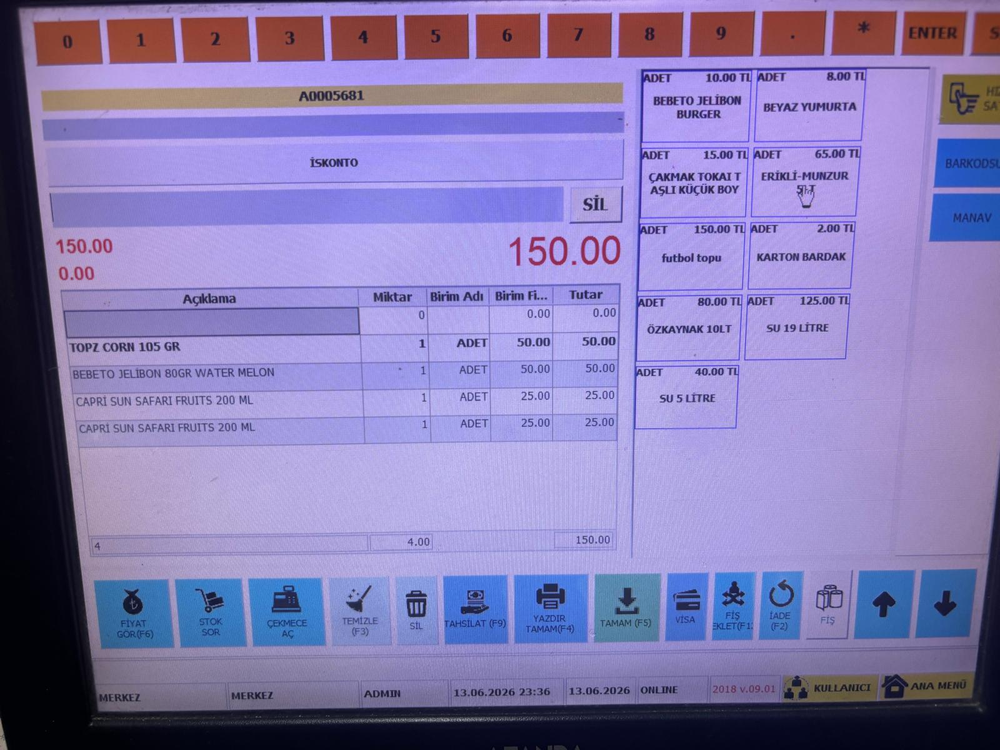
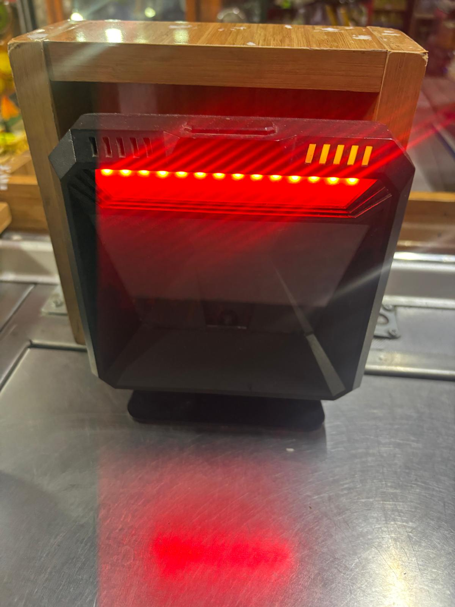
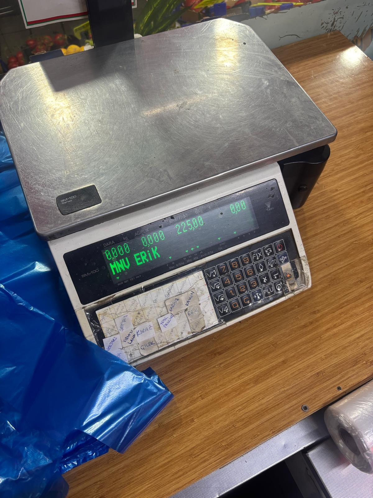

<div align="center">

# 🛒 OYMAPOS - Akıllı Perakende, Kasa & Raf Etiketi Otomasyonu
### Market, Mağaza Raf Etiketi, Hızlı POS Kasa & Terazi Yönetim Sistemi

[](https://github.com/oguztasdemir/Market-Raf-Etiketi---

## 📸 Uygulama Saha & Ekran Goruntuleri

<p align="center">
  
  
  
</p>
Fiyat-Bask--Sistemi)
[](https://www.python.org/)
[](https://github.com/oguztasdemir/Market-Raf-Etiketi---Fiyat-Bask--Sistemi)
[](https://github.com/oguztasdemir/Market-Raf-Etiketi---Fiyat-Bask--Sistemi)

---

</div>

## 🌟 Öne Çıkan Temel Yetenekler

### ⚡ 1. Ultra Hızlı Kasa Terminali (POS)
* **Klavye & Numpad Odaklı İş Akışı:** Mouse'a dokunmadan sadece klavye (`Enter`, `Adet*Barkod`, `F1-F12`) ile saniyeler içinde sepet oluşturma ve tahsilat.
* **Akıllı Barkod Deşifre:** Standart EAN-13, EAN-8 ve terazilerden basılan **27/28 prefixli gramaj/fiyat barkodlarını** anında gram-fiyat olarak parçalama.
* **Çoklu Ödeme & Parçalı Tahsilat:** Aynı fiş içinde Nakit, Kredi Kartı ve Veresiye parçalı ödeme desteği; otomatik para üstü hesabı.
* **Askıya Alma & Çağırma:** Kasada bekleyen müşterilerin fişlerini askıya alıp sıradaki müşteriye geçebilme.

### 🏷️ 2. ZPL II Akıllı Termal Raf Etiketi & Baskı Motoru
* **Yasal Standartlara %100 Uyumlu:** Birim Fiyatı (TL/Kg - TL/Lt), Yerli Üretim Logosu, Üretim Yeri ve Değişiklik Tarihi otomatik hesaplanır.
* **Windows RAW Spooler:** Sürücü gecikmesi olmadan termal yazıcılara (Xprinter, Zebra, Argox vb.) doğrudan ham ZPL II kodu basımı.
* **Toplu Etiket Havuzu:** Fiyatı değişen ürünleri tek tıkla baskı kuyruğuna atıp seri etiket çıkarma.

### ⚖️ 3. Terazi Entegrasyonu & Manav Yönetimi
* **PLU Tuş Matrisi:** Manav, şarküteri ve kasap ürünleri için renkli, resimli hızlı seçim butonları.
* **Terazi Fiyat Senkronizasyonu:** DIGI (SM-100 vb.) ve Perkon barkodlu terazilere tek tıkla ağ üzerinden fiyat ve PLU yükleme.

### 📱 4. Mobil El Terminali (Kamera Barkod Okuyucu)
* **Reyon Gezerek Fiyat/Stok Kontrolü:** Kasiyer veya mağaza sorumlusu telefon/tablet kamerasıyla HTTPS üzerinden barkod okutarak reyonda anında etiket basabilir veya fiyat güncelleyebilir.
* **Sıfır Ek Cihaz Maliyeti:** Pahalı el terminalleri yerine personelin kendi akıllı telefonları tam teşekküllü el terminaline dönüşür.

### 💼 5. Ön Muhasebe, Veresiye & Raporlama
* **Veresiye Defteri (Cari):** Müşteri bazında borç/alacak takibi, limit kontrolleri ve WhatsApp ile tek tıkla hesap özeti/bilgi fişi gönderimi.
* **Kâr & Ciro Analizi:** Günlük/Aylık net kâr, satılan ürün adetleri, maliyet analizi ve yazdırılabilir X/Z Raporları.
* **Yoğunluk Isı Haritası:** Mağazanın gün ve saat bazında müşteri trafiğini gösteren analitik ısı haritası.

### 🛡️ 6. Dokunmatik POS & Windows 7/10/11 Tam Uyumluluk
* **Afanda & Eski POS Terminalleri Desteği:** Windows 7 SP1 (32-Bit / 64-Bit) dahil tüm sistemlerde sıfır kurulum hatasıyla çalışacak özel DLL ön-yükleme mimarisi.
* **Otomatik Teşhis & Raporlama:** Sistemde bir bileşen eksikse kopyalanabilir tam teşhis raporu sunma yeteneği.

---

## 🏛️ Mimari & Dosya Düzeni

```text
OYMAPOS/
│
├── main.py                               # Flask Backend, REST API & WebSocket Sunucusu
├── desktop_app.py                        # Native Kiosk Pencere Sarmalayıcısı & Win7 Fallback
│
├── backend/                              # 🐍 Çekirdek Python Servisleri
│   ├── ayarlar.py                        # Dinamik Dizin ve Yapılandırma
│   ├── araclar/                          # SQLite Veritabanı ve Excel Senkronizasyon Servisi
│   ├── kasa/                             # POS Motoru, Askı ve Satış API'leri
│   ├── katalog/                          # Ürün Kataloğu, Tohum Veriler & Filtreler
│   ├── terazi/                           # Manav PLU ve Digi SM-100 Terazi İletişim Servisi
│   ├── musteri/                          # Cari Hesap & Veresiye Modülü
│   ├── raporlama/                        # Z Raporu, Isı Haritası ve İstatistikler
│   ├── muhasebe/                         # Gelir/Gider ve Kâr Analizi Servisi
│   ├── donanim/                          # Donanım, Barkod Okuyucu & Port Yönetimi
│   └── yazdirma/                         # Windows RAW Spooler & ZPL Termal Üretici
│
├── frontend/                             # 🌐 Arayüz Katmanı (Vanilla HTML5 / CSS3 / ES6)
│   ├── js/masaustu/                      # Modüler Javascript Kontrolörleri
│   ├── sayfalar/masaustu/                # Modüler HTML Şablonları
│   └── stiller/masaustu/                 # Dark Glassmorphism Stil Sayfaları
│
├── build_tools/                          # 🛠️ Derleme & Setup Araçları
│   ├── compile_launchers.py              # Tek Parça Bağımsız Setup.exe ve Modül Derleyicisi
│   ├── OYMAPOS.spec                      # PyInstaller Masaüstü Derleme Spesifikasyonu
│   └── redist/                           # Windows 7 UCRT & C++ Çalışma Zamanı Kütüphaneleri
│
└── data/                                 # 💾 Veritabanı & Şablonlar (Güncellemelerde Ezilmez)
    └── app.sqlite3                       # Yerel SQLite Ürün & Satış Veritabanı
```

---

## 🚀 Hızlı Başlangıç & Geliştirici Kurulumu

### 1. Kaynak Koddan Çalıştırma

```bash
# 1. Depoyu klonlayın
git clone https://github.com/oguztasdemir/Market-Raf-Etiketi---Fiyat-Bask--Sistemi.git
cd Market-Raf-Etiketi---Fiyat-Bask--Sistemi

# 2. Gereksinimleri yükleyin
pip install -r requirements.txt

# 3. Masaüstü Kiosk Uygulamasını Başlatın
python desktop_app.py

# VEYA sadece Web Sunucusunu Başlatın
python main.py
```

### 2. Bağımsız Tek Parça (Setup.exe) Üretimi

Windows 7, 8, 10 ve 11 uyumlu, tüm bağımlılıkları ve Python çalışma zamanını gömülü barındıran kurulum dosyasını oluşturmak için:

```bash
python build_tools/compile_launchers.py
```
> Bu komut sonucunda `dist/Setup.exe` üretilir.

---

## 🔒 Lisans & Güvenlik
Bu proje perakende satış noktaları, marketler ve şarküteriler için geliştirilmiştir. Tüm hakları saklıdır.
