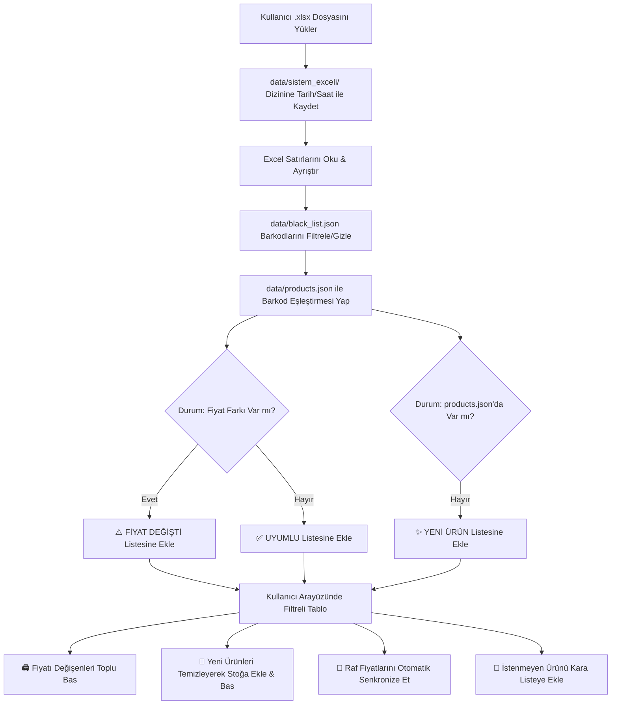

# 📋 Katalog Güncelleme & Fiyat Farkı Senkronizasyon Modülü (Task.md)

Bu doküman, market barkod sistemi/ERP'den dışa aktarılan `.xlsx` stok listelerinin sisteme yüklenmesi, mevcut etiket veritabanı (`products.json`) ile anlık karşılaştırılması, fiyatı değişen ve yeni eklenen ürünlerin otomatik tespit edilerek toplu etiket basılması mimarisini detaylandırır.

---

## 🎯 1. Proje Amacı ve Temel İhtiyaçlar

Marketlerde fiyatlar sık sık güncellenmektedir. Kullanıcı ERP/Barkod programından güncel Excel tablosunu yüklediğinde:
1. **Fiyat Farkı Tespiti:** Raf etiketindeki eski fiyat ile sistemdeki yeni fiyat anında karşılaştırılmalı ve fiyatı değişen ürünler tek ekranda listelenmelidir.
2. **Yeni Ürün Tespiti:** Markete yeni giren ve henüz etiket sisteminde olmayan ürünler belirlenmelidir.
3. **İsim Koruması:** Kullanıcının etiket üzerinde düzelttiği temiz başlıklar (`products.json`) korunmalı; Excel'deki ham/kısaltmalı isim sadece referans olarak gösterilmelidir.
4. **Kara Liste (Blacklist) Filtresi:** Manav, tartılı ürün veya geçici/dummy stok kodları (`black_list.json`) karşılaştırma ekranından otomatik filtrelenmeli, kafa karıştırmamalıdır.
5. **Toplu Etiket Basımı:** Fiyatı değişen tüm ürünlere tek tıkla yeni raf etiketi basılabilmelidir.

---

## 📂 2. Dosya & Dizin Mimarisi

```
Etiket Çıkarıcı/
├── data/
│   ├── products.json              # Aktif raf etiketi ürün kataloğu (4.783 ürün)
│   ├── black_list.json            # Hariç tutulan barkodlar (Manav, dummy kodlar vb.)
│   ├── templates.json             # Etiket modelleri
│   ├── settings.json              # Yazıcı ve sistem ayarları
│   └── sistem_exceli/             # 📁 Yüklenen tüm Excel dosyalarının zaman damgalı arşivi
│       ├── stok_2026-08-19_16-08-00.xlsx
│       └── en_son_stok.xlsx        # Hızlı erişim için son yüklenen dosyanın sembolik kopyası
├── main.py                        # Backend API (Flask)
├── static/
│   ├── js/app.js                  # Frontend iş mantığı
│   └── css/style.css              # Arayüz stilleri
└── templates/
    └── index.html                 # Masaüstü yönetim paneli
```

---

## 🔄 3. İş Akışı ve Senaryolar (Workflow)



---

## 🖥️ 4. Kullanıcı Arayüzü (UI) Tasarımı

### 4.1. Sol Sidebar Menü Eklemesi
- **Yeni Menü Öğesi:** `📊 Katalog Güncelleme` (İkon: `📊` veya `🔄`)

### 4.2. Üst Kontrol & Yükleme Paneli
- **Sürükle-Bırak Excel Yükleme Alanı:** `.xlsx` dosyalarını doğrudan pencereye bırakma veya dosya seçme.
- **Son Yükleme Bilgisi:** *"Son Yüklenen: stok_2026-08-19_16-08.xlsx (19 Ağu 2026 16:08)"*
- **Canlı İstatistik Rozetleri:**
  - 📦 `Excel Toplam: 5.106`
  - ⚠️ `Fiyatı Değişen: 42` (Kırmızı/Turuncu Rozet)
  - ✨ `Yeni Ürün: 15` (Mavi Rozet)
  - ✅ `Fiyatı Aynı: 4.726` (Yeşil Rozet)
  - 🚫 `Kara Liste (Gizlendi): 319` (Gri Rozet)

### 4.3. Hızlı Filtre Butonları
- `[ 🔍 Tümü ]`
- `[ ⚠️ Fiyatı Değişenler (42) ]` *(Varsayılan seçili)*
- `[ ✨ Yeni Ürünler (15) ]`
- `[ ✅ Uyumlu Olanlar ]`
- `[ 🚫 Kara Listedekiler ]`

### 4.4. Karşılaştırma Tablosu Sütunları
| Seçim | Barkod | Sistem Adı (Excel) | Etiket Adı (Mevcut) | Raf Fiyatı (Eski) | Sistem Fiyatı (Yeni) | Durum | İşlem |
| :---: | :---: | :---: | :---: | :---: | :---: | :---: | :---: |
| `[x]` | `8690526...` | `ETI BURCAK 131GR` | `ETİ BURÇAK 131 GR` | `25,00 TL` | `30,00 TL` ↗️ | `⚠️ Fiyat Değişti` | `🏷️ Güncelle & Bas` |
| `[x]` | `8680000...` | `YENI COKOLATA 50G` | *(Henüz Yok)* | `-` | `15,00 TL` | `✨ Yeni Ürün` | `➕ Stoğa Ekle & Bas` |

### 4.5. Toplu İşlem Çubuğu (Batch Bar)
Kullanıcı satırları Shift/Ctrl ile seçtiğinde veya filtre butonlarına bastığında altta beliren aksiyon barı:
- **`🖨️ Fiyatı Değişenleri Toplu Yazdır (42 Etiket)`**: Raf fiyatlarını günceller ve tüm değişen etiketleri basar.
- **`💾 Yeni Ürünleri Otomatik Stoğa Ekle`**: İsimlerini otomatik temizleyerek `products.json`'a kaydeder.
- **`🚫 Seçilileri Kara Listeye Gönder`**: Seçilen barkodları `black_list.json`'a ekler.

---

## ⚙️ 5. Backend API Uç Noktaları (`main.py`)

1. **`POST /api/catalog/upload-excel`**
   - **Girdi:** `multipart/form-data` ile `.xlsx` dosyası.
   - **İşlem:**
     1. Dosyayı `data/sistem_exceli/stok_YYYY-MM-DD_HH-MM-SS.xlsx` olarak diske yazar.
     2. Excel verisini okur.
     3. `black_list.json` ve `products.json` ile diff analizi yapar.
   - **Çıktı:** İstatistikler + Fiyatı değişen, yeni ve uyumlu ürünlerin listesi.

2. **`GET /api/catalog/sync-status`**
   - En son yüklenen Excel analizini ve diff durumunu döner (sayfa yenilendiğinde veriyi korumak için).

3. **`POST /api/catalog/apply-sync`**
   - **Girdi:** Güncellenecek ürün barkodları listesi + Aksiyon türü (`update_prices`, `add_new_products`).
   - **İşlem:** `products.json` dosyasını günceller, zaman damgasını yeniler.

4. **`POST /api/blacklist/add`**
   - **Girdi:** Barkod ve Ürün Adı.
   - **İşlem:** `data/black_list.json` dosyasına ekler.

---

## 🧠 6. Kritik Detaylar ve Dikkat Edilecekler (Edge Cases)

1. **Fiyat Formatı Ayrıştırma:**
   - Excel'deki fiyatlar string (`"49.95 TL"`, `"49,95"`), float (`49.95`) veya integer olabilir.
   - `parse_price(val)` fonksiyonu kuruş ve TL eklerini hassas karşılaştırmalıdır (örn. `30.00 TL` == `30,00 TL` == `30`).
2. **Kullanıcının Düzelttiği Etiket Başlıklarının Ezilmemesi:**
   - Kullanıcı daha önce `products.json` üzerinde başlığı *"ETİ BURÇAK 131 GR"* olarak düzeltmişse, Excel'den gelen ham *"ETI BURCAK 131GR"* başlığı mevcut güzel başlığı **ezmemelidir**; sadece fiyat güncellenmelidir.
3. **Yeni Ürünler İçin Otomatik Temizleme:**
   - Excel'den yeni gelen ürünler `products.json`'a eklenirken oluşturduğumuz Türkçe karakter normalizasyonu ve birim ayırma (`clean_product_string`) filtresinden otomatik geçirilmelidir.
4. **Tarih Damgalı Yedekleme:**
   - `data/sistem_exceli/` klasöründe geçmiş Excel dosyaları saklanarak geriye dönük fiyat geçmişi korunacaktır.

---

## 📅 7. Uygulama Adımları (Roadmap)

- [ ] **Adım 1:** `data/sistem_exceli/` klasörünün oluşturulması.
- [ ] **Adım 2:** Backend'de Excel ayrıştırma ve diff analizi endpoint'lerinin yazılması (`openpyxl` tabanlı).
- [ ] **Adım 3:** `templates/index.html` sol menüsüne `📊 Katalog Güncelleme` sekmesinin ve modern UI bileşenlerinin eklenmesi.
- [ ] **Adım 4:** `static/js/app.js` içerisine Excel yükleme, filtreleme (Fiyatı Değişen / Yeni Ürün) ve toplu güncelleme/baskı fonksiyonlarının entegre edilmesi.
- [ ] **Adım 5:** Test ve doğrulama.
